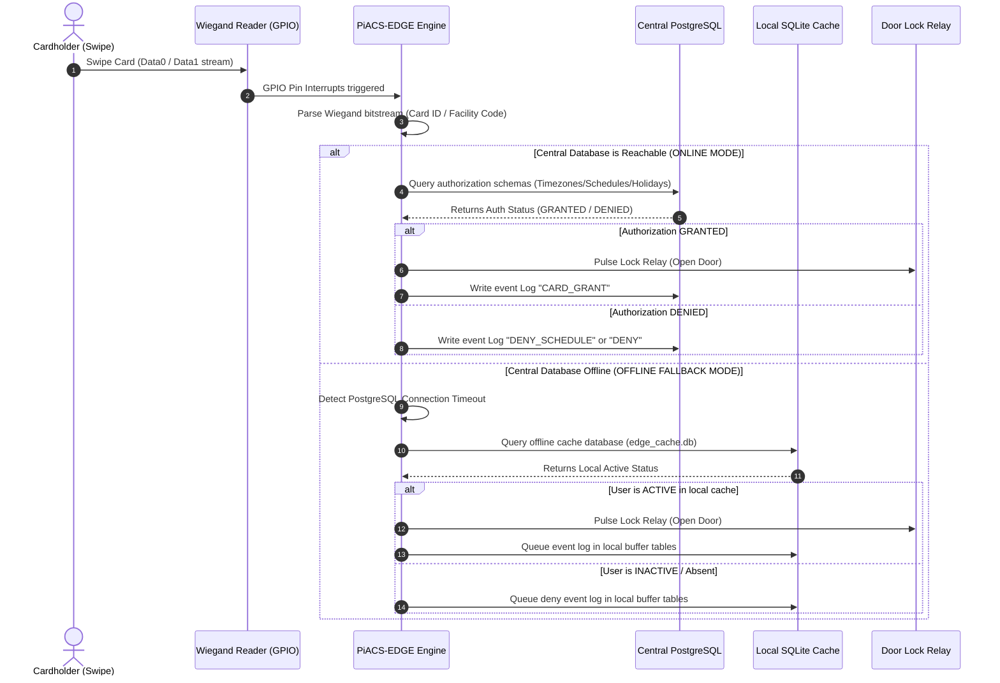
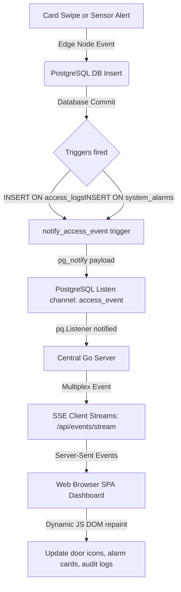

# PiACS-EDGE: Physical Access Control System Edge & Enterprise Management Platform

PiACS-EDGE is an enterprise-grade Physical Access Control System (PACS) engineered for distributed edge execution, local resilience, and centralized management. 

---

## 1. Architectural Layout

```
                         +-----------------------------------+
                         |  Central Management Web Dashboard |
                         |       (HTML5 / CSS3 / JS SPA)     |
                         +-----------------------------------+
                                           ^
                                           | WebSockets / SSE / REST
                                           v
                         +-----------------------------------+
                         |  Central Go Web Server (Port 8000) |
                         +-----------------------------------+
                                    /              \
         Command Overrides (HTTPS) /                \ Sync & Audit logs
                                  v                  v
                       +-------------------+   +--------------------+
                       | PiACS-EDGE Engine |<->| PostgreSQL Database|
                       |  (Raspberry Pi)   |   |   (Port 5432)      |
                       +-------------------+   +--------------------+
                           /           \
                 Local IO /             \ Fallback Lookups
                         v               v
            [Peripherals, Readers]   [Local SQLite Cache]
```

---

## 2. Advanced Network Deployment & Traversal Strategies

To support deployment across diverse enterprise topologies, subnets, firewalls, and isolated dynamic IP boundaries, PiACS-EDGE supports three distinct networking models.

### Deployment Model A: Direct Routing (Standard Subnet)
Used when the Central Management Server and all Edge Controllers reside in routeable subnets with no blockages on standard communication ports.

```
+------------------------------------+              +------------------------------------+
|       Central Server VM            |              |      Edge Node (Raspberry Pi)      |
|       IP: 192.168.0.140            |              |      IP: 192.168.1.200             |
|  - REST/SSE Server (Port 8000)     |<============>|  - HTTPS Override API (Port 8080)   |
|  - PostgreSQL DB (Port 5432)       |              |  - Local Hardware Engine           |
+------------------------------------+              +------------------------------------+
```
* **Traffic Flow (Node -> DB)**: Edge nodes query the central PostgreSQL instance directly via TCP `5432`.
* **Traffic Flow (Server -> Node)**: The central server issues command overrides (Remote Unlock, Lockdown, config sync) by sending secure HTTPS requests directly to the edge node's API at `https://192.168.1.200:8080`.

---

### Deployment Model B: Secure NAT / Firewall Traversal (Reverse SSH Tunnel)
Used when Edge Controllers are placed behind strict local NAT routers or firewalls that prevent incoming connections to `port 8080` (preventing central server override requests), while outgoing TCP ports are allowed.

```
+------------------------------------+              +------------------------------------+
|       Central Server VM            |              |      Edge Node (Raspberry Pi)      |
|       Public IP: 192.168.0.140     |              |      Private IP (NAT): 10.0.8.4    |
|                                    |              |                                    |
|   Receives Tunnel on Port 18080    |<=============|--- Establishes outbound SSH tunnel |
|   (Proxies to Pi's port 8080)      |              |    to root@192.168.0.140           |
+------------------------------------+              +------------------------------------+
```

#### Step 1: Configure sshd on the Central Server
Ensure gateway ports are allowed so loopback bindings are reachable. In `/etc/ssh/sshd_config` on the Central Server:
```text
GatewayPorts yes
ClientAliveInterval 30
ClientAliveCountMax 3
```
Then restart the SSH service: `sudo systemctl restart ssh`

#### Step 2: Configure systemd Tunnel Service on the Edge Node (Pi)
Create `/etc/systemd/system/piacs-tunnel.service` on the edge node to automatically maintain the connection:
```ini
[Unit]
Description=PiACS-EDGE Reverse SSH Tunnel Gateway
After=network.target

[Service]
Type=simple
ExecStart=/usr/bin/ssh -o ExitOnForwardFailure=yes -o ServerAliveInterval=30 -o ServerAliveCountMax=3 -N -R 18080:localhost:8080 root@192.168.0.140
Restart=always
RestartSec=10

[Install]
WantedBy=multi-user.target
```
Enable and start the tunnel on the Pi:
```bash
sudo systemctl daemon-reload
sudo systemctl enable piacs-tunnel.service
sudo systemctl start piacs-tunnel.service
```

#### Step 3: Register the Controller
On the management dashboard, register the controller with the loopback routing address as its server IP:
* **Controller ID**: `EDGE-NODE-01`
* **IP Address**: `127.0.0.1:18080` (The central server will target its local port `18080` which routes directly through the tunnel to the Pi's port `8080`).

---

### Deployment Model C: Flat Virtual Mesh Network (WireGuard VPN)
Used when deploying controllers across multiple remote, dynamic IP networks. This is the **most secure** and robust architecture for enterprise environments.

```
       +-------------------------------------------------------------+
       |                        WireGuard VPN                        |
       |                        Subnet: 10.8.0.0/24                  |
       +-------------------------------------------------------------+
                            /                           \
                           v                             v
            +-----------------------------+       +-----------------------------+
            |      Central Server VM      |       |    Edge Node (Raspberry Pi) |
            |      Virtual IP: 10.8.0.1   |       |    Virtual IP: 10.8.0.2     |
            +-----------------------------+       +-----------------------------+
```

#### Central Server WireGuard Setup (`/etc/wireguard/wg0.conf`)
```ini
[Interface]
PrivateKey = <CENTRAL_SERVER_PRIVATE_KEY>
Address = 10.8.0.1/24
ListenPort = 51820
PostUp = iptables -A FORWARD -i %i -j ACCEPT; iptables -t nat -A POSTROUTING -o eth0 -j MASQUERADE
PostDown = iptables -D FORWARD -i %i -j ACCEPT; iptables -t nat -D POSTROUTING -o eth0 -j MASQUERADE

# Edge Node 1
[Peer]
PublicKey = <EDGE_NODE_01_PUBLIC_KEY>
AllowedIPs = 10.8.0.2/32
```

#### Edge Node WireGuard Setup (`/etc/wireguard/wg0.conf`)
```ini
[Interface]
PrivateKey = <EDGE_NODE_01_PRIVATE_KEY>
Address = 10.8.0.2/24

[Peer]
PublicKey = <CENTRAL_SERVER_PUBLIC_KEY>
Endpoint = 192.168.0.140:51820
AllowedIPs = 10.8.0.0/24
Keepalive = 25
```
Start WireGuard on both endpoints: `sudo wg-quick up wg0`

#### Configuration Mapping:
* **Central Database Host** (in the Pi's `config.json`): Set to `10.8.0.1` (the database is reached via the secure VPN address).
* **Controller IP Address** (on the Central Dashboard): Set to `10.8.0.2` (the override API is invoked via the secure VPN address).

---

## 3. Core System Architecture & Event Loops

### A. Autonomous Evaluation & SQLite Caching Flow (Node Uptime Uptime)

When a cardholder swipes their badge, the local dynamic controller follows a strict failover hierarchy to guarantee access authorization even during a complete network or database outage.



#### Offline Logging Queue & Dynamic Upload Sync
While the edge node is offline, event records are logged directly inside the local SQLite database. Once the network is restored, a background worker thread (`syncBufferedLogsToPostgres`) executes:
1. Queries all unsynced logs inside the local SQLite queue.
2. Performs a batch insertion transaction to push them to the central PostgreSQL database.
3. Deletes successfully pushed rows from the local SQLite queue.

Similarly, a background caching thread (`syncPostgresToSQLiteCache`) pulls database records from PostgreSQL hourly and overwrites `edge_cache.db` to keep localized validation credentials fresh.

---

### B. Real-time Live Event Telemetry Loop

The dashboard updates instantly when events occur, eliminating the need for periodic HTTP polling.



---

### C. Edge Controller Auto-Registration

Adding a new controller requires zero manual SQL database queries or prepopulated schemas.

```
[New Edge Node boots up]
          │
          ▼
Get outbound network interface IP dynamically
          │
          ▼
Connects to PostgreSQL database
          │
          ▼
Check: Does controller_id exist in table "controllers"?
         ├─── YES ───► Update transient state only (server_ip, is_online, last_heartbeat)
         └─── NO  ───► Insert new row with default name & server_ip
                         │
                         ▼
                       Insert default pin map schemas into "controller_configs"
```

---

## 4. Hardware Configuration & Wiring Specs

The edge engine utilizes the native Linux GPIO character device interface (`/dev/gpiochip*`) via the `gpiocdev` framework for direct, real-time peripheral control.

### Default GPIO Pin Out Mapping (Configurable in `config.json`)

| Peripheral Component | Pin Mapping | Type | Connection Notes |
|:---|:---:|:---:|:---|
| **Wiegand Data 0 (D0)** | GPIO 14 | Input | Pulse line for 0 bits |
| **Wiegand Data 1 (D1)** | GPIO 15 | Input | Pulse line for 1 bits |
| **Lock Strike Relay** | GPIO 18 | Output | High triggers transistor/driver to activate lock |
| **Reader Red LED** | GPIO 23 | Output | Controls reader LED status feedback |
| **Reader Green LED** | GPIO 24 | Output | Controls green grant feedback |
| **Reader Buzzer** | GPIO 25 | Output | Audio notification driver |
| **Door Status Monitor (DSM)** | GPIO 8 | Input | Detects door closed (Normally Closed sensor recommended) |
| **Request to Exit (REX)** | GPIO 7 | Input | Motion sensor or push button input |
| **Alarm Siren Horn** | GPIO 12 | Output | High engages external security siren relay |

### Physical Peripheral Wiring Overview

```text
               +----------------------------------------+
               |         Raspberry Pi Edge Node         |
               +----------------------------------------+
                  |    |     |      |     |     |     |
            14(In) 15(In) 18(Out) 23(Out) 24(Out) 8(In)  7(In)
              |      |     |      |     |     |     |
              |      |     |      |     |     |     +--- [ REX Exit Button ]
              |      |     |      |     |     +--------- [ DSM Door Sensor ]
              |      |     |      |     +--------------- [ Green Reader LED ]
              |      |     |      +--------------------- [ Red Reader LED ]
              |      +---------------------------- [ Lock Relay Board ]
              |      +---------------------------------- [ Card Reader Wiegand D1 ]
              +----------------------------------------- [ Card Reader Wiegand D0 ]
```

> [!IMPORTANT]
> Ensure common ground (GND) is shared between the Raspberry Pi, the external Wiegand reader power supply, and the relay boards to prevent floating voltage references.

---

## 5. Quick Installation & Execution Guide

### Central Server Deployment (ACS-FRONTEND)
1. Initialize the PostgreSQL schemas:
   ```bash
   psql -d piacs_security -f db_schema_schedules.sql
   psql -d piacs_security -f db_schema_lenels2.sql
   psql -d piacs_security -f triggers.sql
   ```
2. Build and run the server:
   ```bash
   cd central_server
   go build -o central-server .
   ./central-server
   ```

### Edge Controller Deployment (Raspberry Pi)
1. Build the local engine (CGO is required for the SQLite driver):
   ```bash
   CGO_ENABLED=1 go build -ldflags="-s -w" -o piacs-edge-engine .
   ```
2. Run the executable:
   ```bash
   sudo ./piacs-edge-engine
   ```
